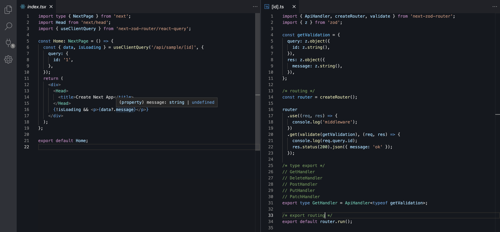

# next-zod-router

A library for simple API routing in Next.js
while leveraging Zod and Typescript to create typesafe routes and middlewares with built in validation.



## Motivation

I wanted to create type-safe APIs in Next.js using zod and also wanted to generate type definition files for client-side use so that I could use intuitive API calls.
But I couldn't find a library that met my needs, so I created this library.

## Features

- Type-safe API routing
- Type-safe API call
- Validation using zod
- Error handling
- Type definition file generation for client-side use
- Middleware support

## Demo

https://stackblitz.com/edit/next-typescript-32qrbx?embed=1&file=pages/index.tsx&file=pages/api/sample/[id].ts&hideNavigation=1&view=editor

## Usage

### Installation


```bash
## npm
npm install next-zod-router

## yarn
yarn add next-zod-router
```

### Server-side

1. Use zod to define the types for body, query, and res.
2. Create routing handling with createRouter.
3. Assign types to the created routing handling with validate.
4. Export the types as GetHandler and PostHandler.

```ts
// pages/api/sample.ts
import { ApiHandler, createRouter, validate } from "next-zod-router";
import { z } from "zod";

/* Schema definition using zod */
const postValidation = {
  body: z.object({
    foo: z.string(),
  }),
  query: z.object({
    bar: z.string().optional(),
  }),
  res: z.object({
    message: z.string(),
  }),
}

const getValidation = {
  query: z.object({
    bar: z.string().optional(),
  }),
  res: z.object({
    message: z.string(),
  }),
}    

/* Routing */
const router = createRouter()

router
  .use((req, res, next) => {
    console.log("middleware");
    return next()
  })
  .post(
    validate(postValidation),
    (req, res) => {
      req.body.foo;
      req.query.bar;
      res.status(200).json({ message: "ok" });
    })
  .get(
    validate(getValidation),
    (req, res) => {
      req.query.bar;
      res.status(200).json({ message: "ok" });
    })

/* Type export */
// the export type name should be as follows
// so that the type definition file can be generated correctly via the command.
export type PostHandler = ApiHandler<typeof postValidation>
export type GetHandler = ApiHandler<typeof getValidation>

/* Routing handling export */
export default router.run()
```

### Type generation


```bash
## npm
npx next-zod-router

## yarn
yarn next-zod-router
```

Adding a script to your package.json is convenient.

```json
{
  "scripts": {
    "apigen": "next-zod-router"
  }
}
```

```bash
npm run apigen
```

### Client-side

```ts
import { client } from "next-zod-router";

// Type-safe API call
const { data, error } = await client.post("/api/sample", {
  query: {
    bar: "baz",
  },
  body: {
    foo: "bar",
  },
})
```


### dynamic routing

#### Server-side

```ts
// pages/api/[id].ts

const getValidation = {
  // 👇 for server side validation
  // 👇 also necessary for client side url construction
  query: z.object({
    id: z.string().optional(),
  }),
}

router
  .get(
    validate(getValidation),
    (req, res) => {
      req.query.id;
      res.status(200).json({ message: "ok" });
    })
```

#### Client-side

```ts
// client.ts
import { client } from "next-zod-router";

client.get("/api/[id]", {
  query: {
    id: "1",
  },
})

// url will be /api/1
```


### Error handling


#### throw error

```ts
// pages/api/sample.ts
router
  .post(
    validate(postValidation),
    (req, res) => {
      const session = getSession(req)
      if (!session) {
        throw createError(401, "Unauthorized")
      }
      res.status(200).json({ message: "ok" });
    })
```

#### custom error handling

```ts
// pages/api/sample.ts

router
  .onError((err, req, res) => {
    // custom error handling
    res.status(err.statusCode).json({ message: err.message });
  })
```

### Middleware

express-like middleware is supported.

```ts
// pages/api/sample.ts
import cors from "cors";
import { createRouter, validate } from "next-zod-router";
import { z } from "zod";

const postValidation = {
  res: z.object({
    message: z.string(),
  }),
}

router
  .use(cors())
  .post(
    validate(postValidation),
    (req, res) => {
      res.status(200).json({ message: "ok" });
    })
```


## Command options

The default pages directory is `pages`, so if you want to change it, you can use the `--pagesDir` option.

```bash
next-zod-router --pagesDir=src/pages
```

| Option | Description | Default value |
| --- | --- | --- |
| --pagesDir | Pages directory | pages |
| --baseDir | Project directory | . |
| --distDir | Type definition file output destination	 | node_modules/.next-zod-router |
| --moduleNameSpace | Type definition file module name | .next-zod-router |
| --watch | Watch mode | false |

## Tips

### Add session property to Request type

If you want to add session property to Request type, you can use the following code.

```ts
// global.d.ts
import { IncomingMessage } from "http";

declare module 'next' {
  export interface NextApiRequest extends IncomingMessage {
    session: Session
  }
}
```

### Next.js development

When developing with Next.js, you can use the following code to generate type definition files automatically.

```json
{
  "scripts": {
    "dev": "npm-run-all -p dev:*",
    "dev:next": "next dev",
    "dev:apigen": "next-zod-router -w"
  }
}
```